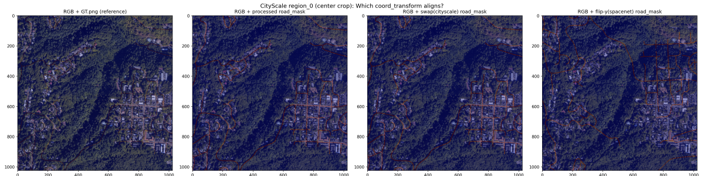
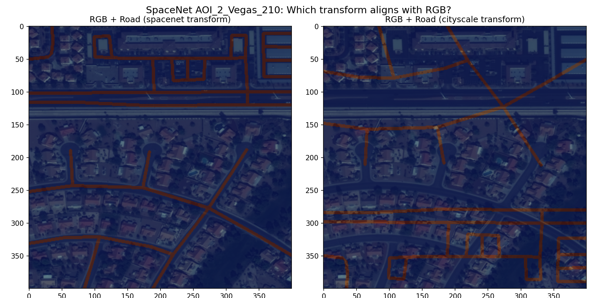
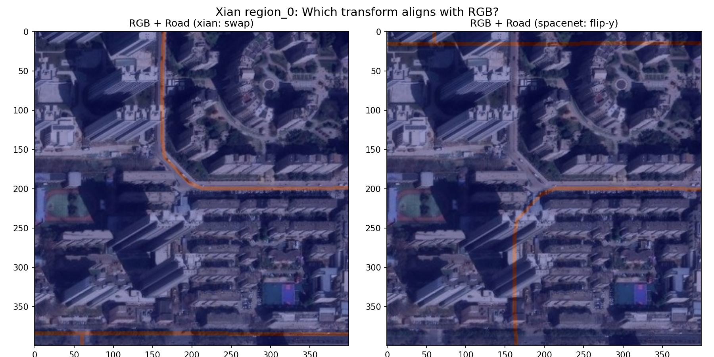

# SAM-Road 数据集与坐标系分析

## 一、项目模型架构概览

SAM-Road 包含三个模型变体，共享 **SAM 视觉编码器 + TopoNet 拓扑预测** 的核心设计：

### 1.1 原始模型 (`models/sam_road.py` → `SAMRoad`)

```
输入: RGB 遥感影像 [B, H, W, 3] (0-255)
      │
      ▼
┌─ SAM ImageEncoderViT (ViT-B/L/H) ─────────────────────┐
│  输入: (rgb.permute → [B,3,H,W] - pixel_mean) / std    │
│  输出: image_embeddings [B, 256, h, w]                 │
└────────────────────────────────────────────────────────┘
      │
      ├──────────────────────┐
      ▼                      ▼
┌─ MapDecoder ─────────┐  ┌─ TopoNet ────────────────────┐
│  4层反卷积             │  │  BilinearSampler 采样节点特征  │
│  [B,256,h,w]→[B,2,H,W]│  │  Transformer 编码边特征       │
│  输出: mask [B,H,W,2]  │  │  输出: topo_scores            │
│  ch0=keypoint, ch1=road│  │  [B, N_sample, N_pair, 1]     │
└───────────────────────┘  └────────────────────────────────┘
```

- **损失**: `mask_loss (BCE/Focal) + topo_loss (BCE, masked)`
- **支持 LoRA**: 冻结 encoder，在 qkv 上加低秩适配

### 1.2 4通道模型 (`models/sam_road_4ch.py` → `SAMRoad`)

在原始模型基础上扩展为 4 通道输入（RGB + Active Prior Mask）：

| 修改点 | 原始 | 4通道 |
|--------|------|-------|
| `pixel_mean/std` | `[3]` 维 | `[4]` 维，第4通道 mean=0, std=1 |
| `patch_embed.proj` | `Conv2d(3, out_ch, ...)` | `Conv2d(4, out_ch, ...)` |
| 权重初始化 | SAM 预训练 | 前3通道拷贝SAM权重，第4通道全零 |
| LoRA 解冻 | 只解冻 qkv | 额外解冻 `patch_embed` 层 |
| 优化器 | qkv 参数 | qkv + `patch_embed` 参数 |

**训练时先验增强策略**:
- 20% 概率: 全黑先验 (保持纯视觉生成能力)
- 60% 概率: 腐蚀先验 (随机擦除块，模拟轨迹中断)
- 20% 概率: 完美GT (让模型学习信任准确先验)

### 1.3 补全模型 (`models/sam_road_completion.py` → `SAMRoadCompletion`)

专门为路网补全设计的模型，输入 RGB + 已知路网特征图：

```
输入: rgb [B,H,W,3] + road_feature_map [B,4,H,W]
      │                        │
      ▼                        ▼
┌─ SAM Encoder ──────┐  ┌─ RoadGraphEncoder ──┐
│  image_embeddings   │  │  CNN 编码 4通道特征   │
│  [B, 256, h, w]    │  │  road_embeddings     │
└────────────────────┘  │  [B, 256, h, w]      │
      │                  └──────────────────────┘
      │                           │
      └───────── concat ──────────┘
                  │
           FeatureFusion (1x1 Conv)
                  │
          fused_features [B, 256, h, w]
                  │
      ┌───────────┼───────────┐
      ▼                       ▼
┌─ MapDecoder ──────┐  ┌─ TopoNetCompletion ──────────┐
│ (只用 image_       │  │  BilinearSampler(融合特征)     │
│  embeddings)      │  │  + RoadGraphGNN 编码已知图拓扑 │
│ 分割头不混入路网     │  │  pair_proj 输入 +2*graph_dim   │
│  信息避免过拟合      │  │  输出: topo_scores              │
└────────────────────┘  └─────────────────────────────────┘
```

**已知路网特征图 4 通道**:
- ch0: 已知道路 mask (哪里有路)
- ch1: 距离场 (离已知路多远，归一化到 64px ≈ 1.0)
- ch2: 方向场 (已知路的方向，归一化到 [0,1])
- ch3: 已知节点位置 (度≠2 的关键节点)

**RoadGraphGNN**: MultiheadAttention 在已知路网的边上做消息传递，为每个节点生成 `graph_dim` 维图拓扑嵌入，拼接到 TopoNet 的 pair_proj 输入中。

---

## 二、数据集组织方式

### 2.1 三种数据集对比

| 属性 | CityScale | SpaceNet | Xian (DiDi) |
|------|-----------|----------|-------------|
| **图片尺寸** | 2048×2048 | 400×400 | 400×400 |
| **卫星影像** | `region_{id}_sat.png` | `{id}__rgb.png` | `region_{id}_sat.png` |
| **GT 图 pickle** | `region_{id}_refine_gt_graph.p` | `{id}__gt_graph.p` | `region_{id}_refine_gt_graph.p` |
| **GT mask** | `region_{id}_gt.png` | `{id}__gt.png` | `region_{id}_gt.png` |
| **Active mask** | 无 | 无 | `region_{id}_active.png` |
| **Active graph** | 无 | 无 | `region_{id}_active_graph.pickle` |
| **GT graph (另)** | 无 | 无 | `region_{id}_graph_gt.pickle` |
| **真实轨迹 traj** | 无 | 无 | `region_{id}_traj.png` |
| **数据划分** | 180个 tile, 手动分 | `data_split.json` | `data_split.json` |
| **SAMPLE_MARGIN** | 64 | 0 | 0 |
| **Epoch 大小** | (2048/patch)² × 2500 | 84667 | 302×200 |
| **样本总数** | 180 | 2549 | 378 |

### 2.2 目录结构

**CityScale**:
```
datasets/cityscale/
├── 20cities/
│   ├── region_0_sat.png                    # 卫星影像
│   ├── region_0_gt.png                     # GT 道路 mask
│   ├── region_0_refine_gt_graph.p          # GT 图 (pickle)
│   ├── region_0_graph_gt.pickle            # GT 图 (另一种格式)
│   └── ...
├── processed/                              # generate_labels.py 生成
│   ├── keypoint_mask_0.png
│   └── road_mask_0.png
├── data_split.json
└── generate_labels.py
```

**SpaceNet**:
```
datasets/spacenet/
├── RGB_1.0_meter/
│   ├── AOI_2_Vegas_210__rgb.png          # 卫星影像
│   ├── AOI_2_Vegas_210__gt.png           # GT 道路 mask
│   ├── AOI_2_Vegas_210__gt_graph.p      # GT 图 (pickle)
│   ├── AOI_2_Vegas_210__gt_graph_dense.p  # 密集图
│   └── ...
├── processed/                             # generate_labels.py 生成
│   ├── keypoint_mask_AOI_2_Vegas_210.png
│   └── road_mask_AOI_2_Vegas_210.png
└── data_split.json
```

**Xian (DiDi)** — 扁平结构 (与 cityscale/spacenet 对齐, 2019_400 类似 spacenet 的 RGB_1.0_meter):
```
datasets/didi/xian/
├── 2019_400/                              # region 文件直接在此 (不再嵌套 xian_2019_400/)
│   ├── region_0_sat.png                   # 卫星影像
│   ├── region_0_gt.png                    # GT 道路 mask
│   ├── region_0_active.png                # Active (DiDi 已有路网) mask
│   ├── region_0_traj.png                  # 真实 GPS 轨迹二值图 (DelvMap, 已对齐)
│   ├── region_0_refine_gt_graph.p         # GT 图 (pickle, 训练用)
│   ├── region_0_graph_gt.pickle           # GT 图 (另一种格式)
│   ├── region_0_active_graph.pickle       # Active 图 (pickle)
│   └── ...
├── processed/                             # generate_labels.py 生成 (与 2019_400 同级)
│   ├── keypoint_mask_0.png
│   └── road_mask_0.png
└── data_split.json                        # 与 2019_400 同级
```

> **编号约定**: tile 从左上角(NW)开始, 行优先 TL→BR (i=0=最北行, j=0=最西列)。
> 共 378 块 (21 行 × 18 列), bbox=DelvMap 西安范围 lat[34.206385,34.279658] lon[108.917423,108.99286]。
> 边缘 tile 超出 DelvMap 大图范围的像素 (下边/右边) 补黑; sat/traj/rn/active 四模态黑边一致 (rn 用 clip_bbox 裁到 DelvMap extent, 不画黑边区域的路)。

#### 2.2.1 Xian 数据制备流程

`tools/prepare_dataset/download_use_osm.py` + `tools/prepare_dataset/generate_traj.py`，配置 `tools/prepare_dataset/config/xian.json` (size=400, DelvMap 西安 bbox)。

**步骤**（从 `datasets/didi/xian/2019_400/` 目录运行）：

1. **sat + rn + active**（`download_use_osm.py --dataset_type trajectory`）：
   - 卫星图：`--sat_source local:/path/to/DelvMap/rawdata/sat_img.png`，从 DelvMap 的 5625×6610 Web Mercator 大图按**经纬度逐像素 Mercator 重投影**采样（ESRI 不可达时用此；默认仍 `esri`）。
   - GT 路网图 (`region_*_gt.png` / `graph_gt.pickle` / `refine_gt_graph.p` / `samplepoints.json`)：从 OSM PBF (`osm/xian-plus-190101.osm.pbf`) 构建，密集化 + Cohen-Sutherland 裁剪 + 精修。
   - Active 路网 (`region_*_active.png` / `active_graph.pickle`)：从 DiDi shapefile (`osm/rn-comp-xa-190101-seg5/edges.shp`) 构建。
   - rn/active 用 `clip_bbox` 只取 DelvMap extent 内的节点，保证与 sat/traj 黑边对齐。
   - 编号 NW-first (左上→右下)，边缘 tile 下边/右边补黑。
2. **road_mask / keypoint_mask**（`generate_labels.py --root .`，IMAGE_SIZE=400）：从 `refine_gt_graph.p` 生成，写入上一层 `processed/`。
3. **真实轨迹 traj**（`generate_traj.py`）：读 DelvMap `rawdata/traj_heat.png` (5625×6610 Mercator，快递员 GPS 二值热力图)，按同一条经纬度 Mercator 重投影采样进每个 tile，二值化 (>0→255) + 可选 3×3 闭运算 (`--mode traj`/`point`)，输出 `region_{c}_traj.png`，边缘补黑。
4. **data_split.json**（`data/img_folder_to_json_list.py`）：378 块，train 302 / val 37 / test 39 (seed=42)。

> **对齐保证**：sat 与 traj 用**同一条**经纬度→Mercator 重投影公式（复用 DelvMap `wgs84_to_mercator`），城市四角精确落到大图四角。traj vs DelvMap 原生栅格 IoU ≈ 0.7-0.8（验证对齐正确）。
> **坐标系**：tile 内部是 WGS84 线性像素坐标系，左上原点 y-down (北在顶)，节点坐标 (y, x) — 与 CityScale 一致，`coord_transform = v[:, ::-1]`。

### 2.3 数据完整性验证

| 数据集 | 源文件数 | processed masks | 状态 |
|--------|---------|----------------|------|
| **CityScale** | 180 regions | 180 road + 180 keypoint | ✅ 完整 |
| **SpaceNet** | 2549 samples (data_split.json) | 2549 road + 2549 keypoint | ✅ 完整 |
| **Xian** | 378 regions (21×18) | 378 road + 378 keypoint | ✅ 完整 |

### 2.4 Pickle 文件格式

所有 pickle 文件都是 **邻接字典** 格式：

```python
# gt_graph: dict
# key: tuple (float, float) → 节点坐标
# value: list of tuple → 邻居节点列表
#
# 示例:
gt_graph = {
    (351.0, 188.0): [(299.0, 190.0), (351.0, 168.0)],
    (299.0, 190.0): [(351.0, 188.0), (300.0, 332.0)],
    ...
}
```

**⚠️ 不同数据集的坐标含义不同！** 详见下一节。

---

## 三、🔴 坐标系分析（核心关键点）

### 3.1 三种数据集的坐标系差异

| 数据集 | Pickle 坐标原点 | dim0 含义 | dim1 含义 | 直觉理解 |
|--------|----------------|-----------|-----------|---------|
| **CityScale** | 左上 (图像坐标) | row (从上↓到下) | col (从左→到右) | 和 numpy 数组索引一致 |
| **SpaceNet** | 左下 (数学坐标) | y (从下↑到上) | x (从左→到右) | 和数学坐标系一致 |
| **Xian** | 左上 (图像坐标) | row (从上↓到下) | col (从左→到右) | 和 CityScale 一致 |

### 3.2 坐标变换 (coord_transform)

Dataloader 和模型中统一使用 **图像坐标系 (x, y)**，其中 x 向右、y 向下。因此需要从 pickle 的原始坐标转换：

```python
# CityScale: 简单交换 (row, col) → (x=col, y=row)
coord_transform = lambda v: v[:, ::-1]

# SpaceNet: 交换 + 翻转y轴 (y_math, x) → (x=x, y=SIZE-y_math)
coord_transform = lambda v: np.stack([v[:, 1], 400 - v[:, 0]], axis=1)

# Xian: 简单交换 (row, col) → (x=col, y=row) — 和 CityScale 一样
coord_transform = lambda v: v[:, ::-1]
```

### 3.3 定量验证结果

通过将 pickle 坐标变换后绘制的 road mask 与 GT.png 做 IoU 对比：

**CityScale**:

| 样本 | swap (cityscale) | spacenet (flip-y) | raw |
|------|:---:|:---:|:---:|
| region_0 | **0.6063 ✅** | 0.0300 | 0.0318 |
| region_10 | **0.6459 ✅** | 0.0451 | 0.0425 |
| region_166 | **0.5980 ✅** | 0.0612 | 0.0312 |

**SpaceNet**:

| 样本 | swap (cityscale) | spacenet (flip-y) | raw |
|------|:---:|:---:|:---:|
| AOI_2_Vegas_210 | 0.0293 | **0.6235 ✅** | 0.0316 |
| AOI_2_Vegas_5 | 0.0267 | **0.6665 ✅** | 0.0256 |

**Xian**:

| 样本 | swap (cityscale) | spacenet (flip-y) | raw |
|------|:---:|:---:|:---:|
| region_0 | **0.6051 ✅** | 0.1006 | 0.0069 |
| region_1 | **0.6025 ✅** | 0.1347 | 0.0175 |
| region_2 | **0.6055 ✅** | 0.2224 | 0.0072 |

**结论**:
- CityScale → swap 正确（IoU ~0.60）
- SpaceNet → flip-y 正确（IoU ~0.62）
- Xian → swap 正确（IoU ~0.60）
- IoU 不是 1.0 是因为 mask 生成时的线宽/点半径等绘制参数差异，不是坐标错误

### 3.4 如何判断坐标原点？

**分布特征法**: 统计 pickle 中 dim0 的均值：

```
CityScale:
  region_0:  dim0 percentiles = [36, 343, 873, 1377, 2010]  (均匀分布, 左上原点)

SpaceNet:
  AOI_2_Vegas_210:  dim0 mean=274.0  (偏大 → 左下原点)
  AOI_2_Vegas_5:    dim0 mean=202.9

Xian:
  region_0:  dim0 mean=265.2  (但 IoU 验证为左上原点)
  region_1:  dim0 mean=243.2
  region_5:  dim0 mean=157.1  (偏小 → 也有大量顶部节点)
```

**注意**: dim0 均值偏大不一定就是左下原点！因为路网在图片中的空间分布不同。**最终验证必须依赖 IoU 对比**。

### 3.5 generate_labels.py 与 dataset.py 的一致性

每个数据集的 `generate_labels.py`（生成 keypoint/road mask）和 `dataset.py`（dataloader 中的 coord_transform）必须使用相同的坐标变换：

| 数据集 | generate_labels.py | dataset.py coord_transform | 一致？ |
|--------|-------------------|---------------------------|--------|
| CityScale | `(int(n[1]), int(n[0]))` | `v[:, ::-1]` | ✅ 都是 swap |
| SpaceNet | `(int(n[1]), IMAGE_SIZE-int(n[0]))` | `np.stack([v[:,1], 400-v[:,0]])` | ✅ 都是 swap+flip |
| Xian | `(int(n[1]), int(n[0]))` | `v[:, ::-1]` | ✅ 都是 swap |

**CityScale 的 generate_labels.py 关键代码**:

```python
# datasets/cityscale/generate_labels.py 第84-86行:
for n, neis in gt_graph.items():
    for nei in neis:
        graph.add_edge((int(n[1]), int(n[0])), (int(nei[1]), int(nei[0])))
# 即: x = n[1] (col), y = n[0] (row) → swap
```

**SpaceNet 的 generate_labels.py 关键代码**:

```python
# datasets/spacenet/generate_labels.py 第89-92行:
for n, neis in gt_graph.items():
    for nei in neis:
        ### Transform coordinates to img (x, y)
        graph.add_edge((int(n[1]), IMAGE_SIZE-int(n[0])), (int(nei[1]), IMAGE_SIZE-int(nei[0])))
# 即: x = n[1] (col), y = IMAGE_SIZE - n[0] (flip y) → swap + flip-y
```

**Xian 的 generate_labels.py 注意事项**:

```python
# xian/generate_labels.py 第91-93行:
### Transform coordinates to img (x, y), only spacenet. cityscales is correct
# graph.add_edge((int(n[1]), IMAGE_SIZE-int(n[0])), (int(nei[1]), IMAGE_SIZE-int(nei[0])))  # ← 被注释掉
graph.add_edge((int(n[1]), int(n[0])), (int(nei[1]), int(nei[0])))  # ← 当前使用
```

注释说明：spacenet 需要翻转 y 轴，cityscale 不需要。Xian 使用了 cityscale 的方式（简单交换），IoU 验证确认这是正确的。

---

## 四、Dataloader 数据处理流程

### 4.1 数据加载

```
1. 加载全图到内存:
   - rgb: [IMAGE_SIZE, IMAGE_SIZE, 3]  (0-255 uint8)
   - keypoint_mask: [IMAGE_SIZE, IMAGE_SIZE]  (0-255 uint8)
   - road_mask: [IMAGE_SIZE, IMAGE_SIZE]  (0-255 uint8)
   - active_mask: [IMAGE_SIZE, IMAGE_SIZE]  (0-255 uint8, 仅 didi)
   - gt_graph: dict  (邻接表)
   - GraphLabelGenerator: 预处理好的图标签生成器

2. 预处理:
   - GraphLabelGenerator 在初始化时:
     a. 将 gt_graph 通过 coord_transform 转为图像坐标 (x, y)
     b. 细分图 (subdivide_graph, resolution=4)
     c. 构建 rtree 和 kdtree 空间索引
     d. 找到 crossover 点并排除
     e. 标记交叉点永远保留 (nms_score_override=2.0)
     f. 计算采样权重 (交叉点附近=0.9, 其他=0.1)
```

### 4.2 dataset.py 中各数据集的配置

```python
# data/dataset.py SatMapDataset.__init__

if self.config.DATASET == 'cityscale':
    self.IMAGE_SIZE = 2048
    self.SAMPLE_MARGIN = 64
    rgb_pattern = './datasets/cityscale/20cities/region_{}_sat.png'
    keypoint_mask_pattern = './datasets/cityscale/processed/keypoint_mask_{}.png'
    road_mask_pattern = './datasets/cityscale/processed/road_mask_{}.png'
    gt_graph_pattern = './datasets/cityscale/20cities/region_{}_refine_gt_graph.p'
    train, val, test = cityscale_data_partition()  # 180 tiles, 手动划分
    coord_transform = lambda v : v[:, ::-1]  # swap

elif self.config.DATASET == 'spacenet':
    self.IMAGE_SIZE = 400
    self.SAMPLE_MARGIN = 0
    rgb_pattern = './datasets/spacenet/RGB_1.0_meter/{}__rgb.png'
    keypoint_mask_pattern = './datasets/spacenet/processed/keypoint_mask_{}.png'
    road_mask_pattern = './datasets/spacenet/processed/road_mask_{}.png'
    gt_graph_pattern = './datasets/spacenet/RGB_1.0_meter/{}__gt_graph.p'
    train, val, test = spacenet_data_partition()  # data_split.json
    coord_transform = lambda v : np.stack([v[:, 1], 400 - v[:, 0]], axis=1)  # swap + flip-y

elif self.config.DATASET == 'didi_xian':
    self.IMAGE_SIZE = 400
    self.SAMPLE_MARGIN = 0
    rgb_pattern = 'datasets/didi/xian/2019_400/region_{}_sat.png'           # 扁平结构
    active_mask_pattern = 'datasets/didi/xian/2019_400/region_{}_active.png'
    keypoint_mask_pattern = 'datasets/didi/xian/processed/keypoint_mask_{}.png'
    road_mask_pattern = 'datasets/didi/xian/processed/road_mask_{}.png'
    gt_graph_pattern = 'datasets/didi/xian/2019_400/region_{}_refine_gt_graph.p'
    train, val, test = didi_xian_data_partition()  # data_split.json (302/37/39)
    coord_transform = lambda v : v[:, ::-1]  # swap — 与 CityScale 一致 (top-left, y-down)
```

### 4.3 Patch 采样

```
训练时:
  1. 随机选择图片: img_idx = randint(0, num_imgs)
  2. 随机选择起始坐标: begin_x, begin_y = randint(margin, max)
  3. 裁剪 patch:
     - rgb_patch = rgb[begin_y:end_y, begin_x:end_x, :]
     - mask_patch = mask[begin_y:end_y, begin_x:end_x]
     注意: numpy 数组索引是 [row, col] = [y, x]，而 patch 坐标是 (x, y)

验证时:
  1. 固定的网格采样: linspace 生成均匀采样点
  2. 保证整张图都被覆盖
```

### 4.4 数据增强

```
1. 旋转增强 (训练时):
   - rot_index = randint(0, 4)  (0°, 90°, 180°, 270°)
   - rgb_patch, keypoint_mask, road_mask, active_mask 都做 np.rot90
   - graph_points 也做相应的旋转矩阵变换 (在 GraphLabelGenerator.sample_patch 中)

2. GraphLabelGenerator.sample_patch 中的坐标变换:
   a. 查询 patch 范围内的图节点
   b. NMS 降采样 (保留关键点, 半径=ROAD_NMS_RADIUS)
   c. 采样 N_sample 个源节点 (按权重)
   d. 对每个源节点, KNN 找邻居, BFS 判断是否连通
   e. 坐标变换:
      - 减去 patch 左上角偏移: points -= [x0, y0]
      - 居中: translate to center
      - 旋转: rot_index 次 CCW 90°
      - 居中还原
   f. 加高斯噪声 (scale=1.0 pixel)
```

### 4.5 归一化与输出

```python
# dataset.py __getitem__ 返回:
{
    'rgb':            torch.tensor(input_tensor, float32),  # 3ch: [H,W,3] 0-255
                                                     # 4ch: [H,W,4] RGB 0-255 + Active 0-1
    'keypoint_mask':  torch.tensor(kp, float32) / 255.0,  # [H,W] 0-1
    'road_mask':      torch.tensor(road, float32) / 255.0, # [H,W] 0-1
    'graph_points':   torch.tensor(pts, float32),           # [N,2] 图像坐标 (x,y)
    'pairs':          torch.tensor(pairs, int32),           # [N_s, N_p, 2]
    'connected':      torch.tensor(conn, bool),             # [N_s, N_p]
    'valid':          torch.tensor(valid, bool),            # [N_s, N_p]
}

# 模型前向时的标准化:
# x = (rgb.permute(0,3,1,2) - pixel_mean) / pixel_std
# pixel_mean = [123.675, 116.28, 103.53]  (3ch)
# pixel_std  = [58.395, 57.12, 57.375]     (3ch)
# 4ch: pixel_mean = [123.675, 116.28, 103.53, 0.0], pixel_std = [58.395, 57.12, 57.375, 1.0]
```

### 4.6 4通道模型的数据处理差异

```python
# dataset_4ch.py 额外处理:

# 1. 读取 active mask (所有数据集统一)
active_mask_patch = self.active_masks[img_idx][begin_y:end_y, begin_x:end_x]

# 2. 先验增强 (训练时)
if self.is_train:
    rand_val = random.random()
    if rand_val < 0.2:    # 全黑
        active_mask_patch = np.zeros_like(active_mask_patch)
    elif rand_val < 0.8:  # 腐蚀
        for _ in range(random.randint(3, 10)):
            # 随机擦除块
            active_mask_patch[ey:ey+h, ex:ex+w] = 0
    else:                  # 完美 GT
        pass
elif not self.is_train:
    active_mask_patch = np.zeros_like(active_mask_patch)  # 验证集全黑

# 3. 归一化并拼接
active_mask_patch = active_mask_patch.astype(np.float32) / 255.0  # [H,W] → 0-1
active_mask_patch = np.expand_dims(active_mask_patch, axis=-1)     # [H,W,1]
input_tensor = np.concatenate([rgb_patch, active_mask_patch], axis=-1)  # [H,W,4]
```

### 4.7 补全模型的数据处理差异

```python
# dataset_completion.py 额外处理:

# 1. CompletionGraphLabelGenerator: 随机删边
#    - 保留 keep_ratio 比例的边
#    - 已知边在候选对中 valid=False (不参与 topo loss)
#    - BFS 仍在完整图上做 (目标: 预测完整路网)

# 2. 渲染已知路网特征图
road_feature_map = render_graph_feature_map(known_graph_adj, begin_x, begin_y, PATCH_SIZE)
# → [PATCH_SIZE, PATCH_SIZE, 4]  (mask/距离/方向/节点)

# 3. 同步旋转 (4通道分别 rot90)

# 4. 返回额外字段:
{
    'road_feature_map': torch.tensor(rfm, float32).permute(2,0,1),  # [4,H,W]
    'known_edge_index': torch.zeros(2, 0, long),                     # 占位
}
```

---

## 五、坐标系详解

### 5.1 为什么 SpaceNet 需要翻转 y 轴？

SpaceNet 的 GT 图坐标来自 [SpaceNet 数据集](https://spacenet.ai/)，其坐标系为**数学坐标系**（左下角为原点，y 轴向上）：

```
SpaceNet pickle 坐标系:           图像坐标系 (SAM-Road 内部):

    y ↑                              ← x
      │        (400, 0)             ↓ y
      │                              (0, 0)──────────→
      │                                   │
  (0,0)──────────→ x                  (0, 400)
  
  dim0 = y_math                    dim0 = row (从上到下)
  dim1 = x                         dim1 = col (从左到右)
```

转换公式:
- `x_img = x_pickle = dim1`
- `y_img = IMAGE_SIZE - y_math = IMAGE_SIZE - dim0`

### 5.2 CityScale 和 Xian 不需要翻转

CityScale 和 Xian 的 GT 图坐标已经是**图像坐标系**（左上角为原点，row 从上到下）：

```
CityScale/Xian pickle 坐标系:     图像坐标系:

  (0,0)──────────→ col            (0,0)──────────→ x
  │                                │
  │                                │
  ↓ row                            ↓ y
  
  dim0 = row                      dim0 = row (从上到下)
  dim1 = col                      dim1 = col (从左到右)
```

转换公式:
- `x_img = col_pickle = dim1`
- `y_img = row_pickle = dim0`

即简单的 `v[:, ::-1]`（交换两列）。

### 5.3 在代码中的流转

```
pickle (原始坐标)
    │
    ▼ coord_transform (dataset.py)
图像坐标 (x, y), 以全图左上角为原点
    │
    ├─→ GraphLabelGenerator: 建空间索引, BFS, NMS
    │
    ▼ sample_patch: points -= [x0, y0]
patch 内坐标 (x, y), 以 patch 左上角为原点
    │
    ▼ 居中 + 旋转 + 还原
旋转后的 patch 内坐标
    │
    ▼ + noise (1.0 pixel)
最终 graph_points
    │
    ▼ BilinearSampler: (points / PATCH_SIZE) * 2 - 1
grid_sample 归一化坐标 [-1, 1]
```

---

## 六、可视化验证

### 6.1 验证脚本

项目中提供了以下验证脚本（位于 `scripts/` 目录）:

| 脚本 | 用途 | 运行时间 |
|------|------|---------|
| `visualize_dataset.py` | 完整可视化：4种坐标变换对比、GT overlay、mask 生成对比 | ~2分钟 |
| `simple_overlay.py` | 简洁版：3种变换 vs GT.png 对比 | ~1分钟 |
| `quantitative_verify.py` | 定量验证：计算 IoU 和像素准确率 | ~30秒 |

### 6.2 运行方法

```bash
cd /home/hanhaoyu/workspace/research/sam_road

# 使用 samroad conda 环境
conda activate samroad

# 运行定量验证 (最快)
python scripts/quantitative_verify.py

# 运行简洁可视化
python scripts/simple_overlay.py

# 运行完整可视化 (全部数据集)
python scripts/visualize_dataset.py

# 只运行 CityScale 可视化
python scripts/visualize_dataset.py --dataset cityscale

# 只运行 SpaceNet 可视化
python scripts/visualize_dataset.py --dataset spacenet
```

### 6.3 输出文件

所有可视化结果保存在 `outputs/viz/` 目录下：

#### CityScale 可视化

CityScale swap 变换的 road_mask 与 GT.png / RGB 对齐验证：



*从左到右: RGB+GT.png叠加(参考) / RGB+processed_mask / RGB+swap(cityscale) / RGB+flip-y(spacenet)。swap 使道路与 RGB 完美重合，flip-y 导致道路翻转。*

其他输出文件（运行脚本后生成于 `outputs/viz/`）：

| 文件 | 内容 |
|------|------|
| `cityscale_region_*_alignment_check.png` | 对齐验证：GT.png / processed mask / swap / flip-y 对比 |
| `cityscale_region_*_existing_masks.png` | 已有 processed mask 质量 |
| `cityscale_region_*_quick_check.png` | 快速对比：GT.png vs 3种变换 |

#### SpaceNet 可视化

SpaceNet flip-y 变换的 road_mask 与 RGB 对齐验证：



*从左到右: RGB+swap(cityscale) / RGB+spacenet(flip-y)。flip-y 使道路与 RGB 完美重合，swap 导致道路翻转。*

其他输出文件（运行脚本后生成于 `outputs/viz/`）：

| 文件 | 内容 |
|------|------|
| `spacenet_4transforms.png` | 4种坐标变换的全面对比（raw/swap/flip-y/另一种flip） |
| `spacenet_*_alignment_check.png` | 两种变换与 RGB 的对齐对比 |
| `spacenet_quick_check.png` | GT.png vs 3种变换的快速对比 |
| `spacenet_*_gt_overlay.png` | GT mask 与 RGB 的叠加 |
| `spacenet_*_transform_compare.png` | 两种变换生成的 mask 对比 |

#### Xian 可视化

Xian swap 变换的 road_mask 与 RGB 对齐验证：



*从左到右: RGB+swap(cityscale) / RGB+spacenet(flip-y)。swap 使道路与 RGB 完美重合，flip-y 导致道路翻转。*

其他输出文件（运行脚本后生成于 `outputs/viz/`）：

| 文件 | 内容 |
|------|------|
| `xian_4transforms.png` | 4种坐标变换的全面对比 |
| `xian_region_*_alignment_check.png` | 两种变换与 RGB 的对齐对比 |
| `xian_region_*_existing_masks.png` | 已有 processed mask 质量 |
| `xian_region_*_gt_overlay.png` | GT mask 与 RGB 的叠加 |
| `xian_region_*_active_overlay.png` | Active mask 与 RGB 的叠加 |
| `xian_region_*_quick_check.png` | 快速对比 |

### 6.4 如何阅读对齐图

以 `*_alignment_check.png` 为例：

**CityScale** (1×4 布局):
- 第1列: RGB + GT.png 叠加 → **正确参考**（数据集自带的道路 mask）
- 第2列: RGB + processed/road_mask → generate_labels.py 生成的 mask
- 第3列: RGB + swap(cityscale) 变换的 road_mask → ✅ **道路与 RGB 重合**
- 第4列: RGB + flip-y(spacenet) 变换的 road_mask → ❌ 道路位置错误

**SpaceNet** (1×2 布局):
- 左: RGB + spacenet(flip-y) 变换的 road_mask → ✅ **道路与 RGB 重合**
- 右: RGB + swap(cityscale) 变换的 road_mask → ❌ 道路翻转了

**Xian** (1×2 布局):
- 左: RGB + swap(cityscale) 变换的 road_mask → ✅ **道路与 RGB 重合**
- 右: RGB + flip-y(spacenet) 变换的 road_mask → ❌ 道路位置错误

---

## 七、常见问题与陷阱

### Q1: 为什么不能统一用一种坐标变换？

因为不同数据集的 pickle 坐标系不同。SpaceNet 使用数学坐标系（左下原点），CityScale/Xian 使用图像坐标系（左上原点）。强行统一会导致某个数据集的道路图与影像不对齐。

### Q2: 如何确认新数据集的坐标系？

1. **IoU 验证法** (最可靠):
   - 用 `quantitative_verify.py` 分别测试 swap 和 flip-y 两种变换
   - IoU 高的那个就是正确的坐标变换

2. **GT.png 参考法**:
   - 用 pickle 绘制 road mask，叠加到 RGB 上
   - 目视检查道路是否和图片中的道路重合

3. **坐标分布法** (辅助):
   - 看 pickle 中 dim0 的值域
   - 如果 dim0=0 的节点对应图片**顶部** → 左上原点 → swap
   - 如果 dim0=0 的节点对应图片**底部** → 左下原点 → flip-y

### Q3: generate_labels.py 的作用？

`generate_labels.py` 从 pickle 中的 GT 图生成训练用的 keypoint_mask 和 road_mask（PNG 图片）。这些 mask 在 dataloader 中作为分割任务的监督标签。

**关键**: `generate_labels.py` 中的坐标变换必须和 `dataset.py` 中的 `coord_transform` 一致，否则生成的 mask 和 pickle 中的图数据会对不上。

### Q4: 模型前向传播中对坐标系的处理？

模型内部（`BilinearSampler`）对 graph_points 做的归一化:
```python
sample_points = (sample_points / PATCH_SIZE) * 2.0 - 1.0
```

这假设 graph_points 的坐标范围是 `[0, PATCH_SIZE]`，归一化到 `[-1, 1]` 后用于 `F.grid_sample`。由于 `F.grid_sample` 的坐标系就是图像坐标系（左上为 (-1,-1)，右下为 (1,1)），所以只要 graph_points 在进入模型前已经是图像坐标系就正确。

### Q5: 新增数据集时需要修改什么？

1. `datasets/{new_dataset}/generate_labels.py` — 生成 keypoint/road mask
2. `data/dataset.py` (或 `dataset_4ch.py` / `dataset_completion.py`) — 新增数据集配置:
   - `IMAGE_SIZE`
   - `SAMPLE_MARGIN`
   - 文件路径 pattern
   - `coord_transform`
   - 数据划分函数
3. `config/` — 新增配置 yaml
4. 运行 `quantitative_verify.py` 验证坐标变换正确性

---

## 八、总结

```
┌──────────────────────────────────────────────────────────────────┐
│                    SAM-Road 数据处理全景                          │
├──────────────┬───────────────────┬───────────────────┬──────────┤
│              │    CityScale      │     SpaceNet       │   Xian   │
├──────────────┼───────────────────┼───────────────────┼──────────┤
│ 图片尺寸      │ 2048×2048         │ 400×400           │ 400×400  │
│ pickle 原点   │ 左上 (图像坐标)    │ 左下 (数学坐标)    │ 左上     │
│ coord_transform │ v[:, ::-1]     │ stack+flip-y      │ v[:,::-1]│
│              │ (swap)            │ (swap + flip)      │ (swap)   │
│ generate_labels │ (n[1], n[0])   │ (n[1], SIZE-n[0]) │ (n[1],n[0])│
│ IoU 验证      │ ~0.60 ✅          │ ~0.62 ✅           │ ~0.60 ✅ │
│ processed 完整│ 180/180 ✅        │ 2549/2549 ✅       │ ✅       │
├──────────────┴───────────────────┴───────────────────┴──────────┤
│  核心原则:                                                        │
│  1. pickle → 图像坐标 的变换必须正确                               │
│  2. generate_labels.py 与 dataset.py 的变换必须一致                │
│  3. 新数据集必须用 IoU 定量验证，不能只凭直觉                       │
└──────────────────────────────────────────────────────────────────┘
```
